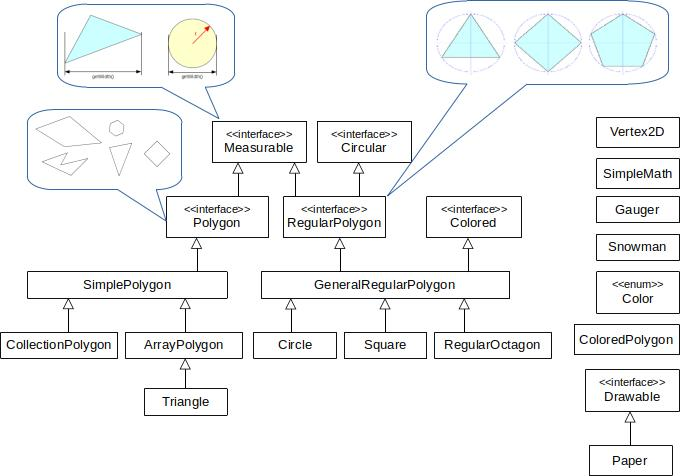
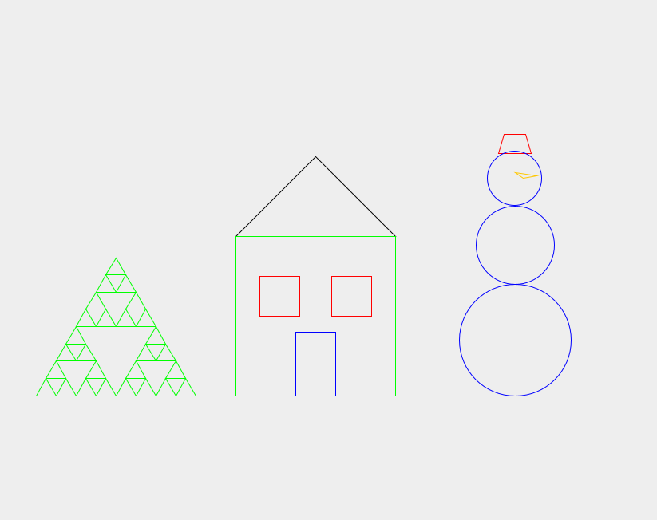

  # 2D Geometry Modeling Library

## Overview
This project is a robust, object-oriented Java library designed for modeling, measuring, and manipulating 2D geometric shapes. It features a scalable class hierarchy that handles everything from basic vertices to complex, recursive polygons and a drawing canvas simulation. 

The primary goal of this project is to demonstrate strong software engineering principles, including encapsulation, polymorphism, design patterns, and effective use of the Java standard library.

## Key Features & Capabilities
* **Comprehensive Shape Hierarchy:** Supports simple polygons, regular polygons, circles, squares, and complex structures.
* **Drawing Simulation:** Includes a Paper canvas (acting as a Drawable interface) that tracks unique geometric entities, prevents duplicates, and manages visual states like colors.
* **Recursive Subdivisions:** Features mathematical logic to recursively divide triangles into smaller sub-triangles based on a specified depth, similar to Sierpiński fractals.
* **Shape Composition:** Allows combining basic shapes into complex objects, such as generating a proportional Snowman using a reduction factor.

## Architecture & Design


The project relies on two main architectural branches:
1.  **Simple Polygons:** Defined by explicit coordinate vertices. It branches into array-backed (ArrayPolygon) and list-backed (CollectionPolygon) implementations to demonstrate different memory management strategies.
2.  **Regular Polygons:** Defined mathematically by a center and a radius (GeneralRegularPolygon). Concrete implementations like Circle, Square, and RegularOctagon inherit from this structure and enforce specific edge counts.

### Software Engineering Concepts Demonstrated
* **Interfaces & Abstract Classes:** Created clear contracts using interfaces (Measurable, Circular, Drawable, Polygon) and shared behavior via abstract classes (SimplePolygon).
* **Decorator Pattern:** Implemented ColoredPolygon to dynamically add color properties to any existing Polygon at runtime without altering the original polygon class's code.
* **Immutability:** Designed core data classes like Vertex2D and ArrayPolygon to be immutable, preventing unintended side effects by defensive copying arrays in constructors.

## Visual Demonstration



A Java Swing graphical interface (VisualDemo.java) is included to translate the underlying mathematical models and Paper canvas logic into rendered pixels. 

### How to Run the Visual Demo

**Option 1: Using an IDE (Recommended)**
1. Clone the repository and open the project in your preferred Java IDE (IntelliJ IDEA, Eclipse, or VS Code).
2. Locate the VisualDemo.java file located in the cz.muni.fi.pb112.project package.
3. Run the main method inside VisualDemo.java. A window will pop up rendering the geometric scenes.

**Option 2: From the Command Line**
1. Open your terminal and navigate to the root directory of the project (the folder containing the cz directory).
2. Compile the project files by running:
   ```bash
   javac cz/muni/fi/pb112/project/**/*.java cz/muni/fi/pb112/project/*.java
